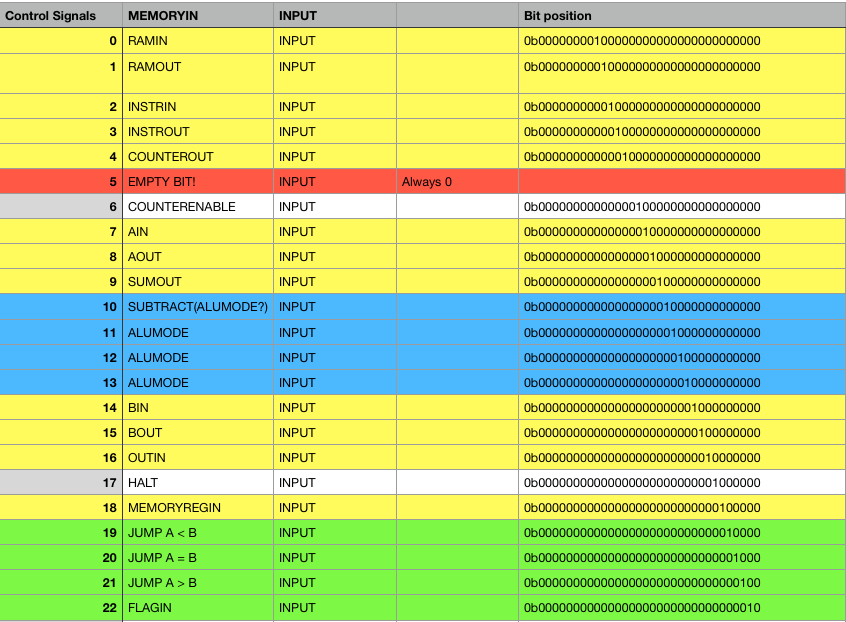

### 8chips Computer Design Overview

##### Instruction Set

An instruction set for a computer defines the machine language for that computer. The instructions are composed of a series of opcodes (*what the computer should do*) and operands (*the inputs to those operations*).

 An instruction for the 8chips computer might look like:

``` 
1. 0000 0110
2. 0000 0001
```

These two lines together constitute a single instruction - but only for the architecture defined for the 8chips computer.

This instruction puts whatever value is on line 2 into the A register. We'll see later how that works, and what an `A Register` is.

For an example processor you might be familiar with, the AVR microcontrollers that power some of the Arduino boards also have a machine code instruction set.
https://en.wikipedia.org/wiki/Atmel_AVR_instruction_set

If you want to see the current instruction set for the 8chips computer you can find it [here](./instruction_set_1.md)

here is an example specification of the instruction shown above :
(**LoadAImmediate**)
___


We'll get to the **microcode** section later. For now we'll focus on the other columns, which denote the **bytecode** which represents this command. The **Operand description**, which describes what form the operands should take for this command. **The LOC in byte code** column notes how many lines of code this instruction will take in its machine code form.

This relates to the sample instruction above as annotated:
``` 
1. 0000 0110 // Load A Immediate command (loads the following value into the A register)
2. 0000 0001 // the value reprsenting the decimal number 1.
```

These instructions are strung together to form machine code computer programs that the computer can run. In the case of the 8chips computer program code is stored in the main RAM. Data is also stored in this same RAM.

#### Computer Overview
##### or whats a register!?
Before we get any deeper into specific implementation details, or refer to specific parts of the computer - let's take a look at a diagram for the design of the 8chips computer. We can refer back to this diagram later.


There is a single 8 bit bus which is used to move data between parts of the computer. The 8 bit width means it can transfer numbers between `0 - 255` in a single transfer.

There is a clock which synchronizes other parts of the computer. It connects to most other parts.

Main Ram (referred to above) is asynchronous static ram and does not require a clock. It is also 8 bits wide, by 256 addresses, so in total it holds 256 bytes. This memory is used to hold
any programs the computer is running as well as any data those programs access. The **Memory Address Register** sets the current address the RAM is writing to and reading from. So to move to another address in RAM we must write to the **Memory Address Register**.

The program counter - is a binary counter which is used to keep track of what line of code the computer should execute. When the clock pules the counter is incremented by 1.

The A and B Registers are 8 bit registers which can hold a byte each, they are tied to the inputs of the ALU (*Arithmetic Logic Unit*) - A and B act as the operands of the computations performed by the ALU. It is capable of additions and subtractions.
Registers are memory locations - in this computer they are specially designated memory locations which are used to set the computer into a specific mode or perform an operation. Here they are implemented using D type [latches](http://www.ti.com/lit/ds/symlink/sn74ls173a.pdf). 

In the case of the AVR / Arduino example - you might write to a register to setup the pins as inputs or outputs - or to read from the analog to digital converter.


The microcode ROM holds microcode instructions for each instruction the computer supports in the instruction set we discussed above. We'll explain what this means in a bit. I like to think of the microcode as the final interface between the software and the actual physical voltages which drive the computer circuits to change state.

#### Microcode Verbs
If you refer back to the sample instruction **Load A Immediate** above you can see there are 4 sub instructions - or microcode instructions that make up the **Load A Immediate** instruction. It's not important right, what these sub instructions do exactly.

What is important is that when the computer sees the **Load A Immediate** instruction in the current program it is executing - the computer must know to then execute the sub instructions. It also must be able to keep track of which sub instructions it has executed - so we need another counter. This is the **Microcode Step Counter** shown in the computer diagram.

Each instruction in a microcode program is the 8chips architecture is a 24 bit word. They look like this:



 Each microcode instruction here is a single bit being brought high of the 24 bit word. These instructions map directly to things like having a register read from the bus, or output to the bus, incrementing the program counter, etc.

 These signals are routed directly to hardware pins to as control signals.

 To combine these signals and execute them together at the same step of the microcode program they can be logically or'd together: `MEMORYREGIN|COUNTERENABLE`. For example, when executed this microcode instruction would instruct the `Memory Address Register` to read from the bus, and the `Program Counter` to increment `+ 1`.

Take another look at the microcode steps for the **Load A Immediate** instruction.
```
1. MI|CO
2  RO|INI|CE
3. MI|CO
4. RO|AI|CE
```

These instructions do the following:
* Put the value of the program counter, out onto the bus, while reading that value into the memory address register.
* writing the value of ram to the bus, while reading into the instruction register, and incrementing the counter.
*Put the value of the program counter, out onto the bus, while reading that value into the memory address register. (this reads the value at the next line of our program) - the operand!
* writing the value of ram to the bus, while reading into the A register, and incrementing the counter.

If that made sense, you can see that the value which was our operand to the instruction will now reside within the A register.

All the instructions for the computer are implemented like this, as a series of microcode programs.

#### Planned 16 bit addressing

You may notice that since our **Memory Address Register** is only 8 bits wide, like all our other registers, that we can only address 256 locations in memory. This is a big limitation of this computer design. To get around it I plan to add a second memory address register. Together these two registers will hold a 16 bit number, up to `65536` potential memory locations for a total ram size of 524288 bits compared to 2048 bits. One register will hold the higher order bits, and the other the lower order bits.

This will require adding more microcode instructions to all the instructions the computer supports which rely on ram access (and will support 16bit addresses).


The computer will still not be able to represent do computations on numbers larger than 8 bits via hardware, the 16bit improvement will be for addressing only - to support longer program sizes we'll also need to increase our prgoram counter to a 16 bit counter, and it will likely also need to be split into to two, and this might require new microcode instructions. Thankfully there are still 3 unused bits in our 24bit microcode words.

